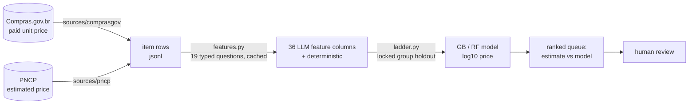

# Preço Justo

**Fair-price estimation for Brazilian public procurement.** A typed LLM reads
each tender line item and answers 19 structured questions (40 numeric columns); a shallow model
learns, from prices actually paid, how to turn those answers into a price.
Tenders whose estimate disagrees with the model go to a human queue.

> Status: **experimental**. The pilot below is real and reproducible from
> this repo, but it was measured on tender-level totals. The item-level
> rerun on paid unit prices is in progress. Nothing here is production.

---

## The problem

Every Brazilian public tender publishes an *estimated* price before bidding.
Overpricing is caught, when it is caught, by looking the item up in a
catalogue price panel. That works for catalogued items. It does nothing for
the free-text line ("contratação de subscrição de licenças de software
Adobe, nos termos da tabela...") that never matches a code. Those items are
invisible to the tools auditors have today.

## Three decisions that define the project

**1. Two prices, two roles.** A purchase has two numbers: what the agency
*estimated* (PNCP, before bidding) and what was actually *paid*
(Compras.gov.br, after the auction). The model trains on the paid price and
is applied to the estimate. Training on the estimate would be circular: a
commonly inflated estimate would be predicted correctly and never flagged.
The two numbers come from different processes, so their disagreement carries
information. The bridge between the two sources is the description text,
which is exactly what a catalogue lookup cannot use.

**2. The LLM is a feature extractor, not a price oracle.** Instead of asking
the model "what does this cost?", the pipeline asks it 19 *typed* questions
about the description (how specific is it, what tier, single delivery or
recurring, how much implementation effort, which category...). Each answer
is a probability distribution over a small ordered scale, so it becomes
numbers directly: the expected level, and the spread. A gradient-boosted
model then learns the mapping to Brazilian prices. The hypothesis, stated
before measuring: *the LLM knows what things cost in the world; local data
teaches the local correction.* If true, LLM features plus a model must beat
both the model without the LLM and the LLM without the model.

**3. Evaluate on a ladder, not a number.** Every rung isolates one claim,
and the LLM's direct price guess is a rung of its own, kept out of every
learned rung's feature matrix.

## Architecture



| Module | Role |
|---|---|
| `precojusto/questions.py` | the schema: 19 typed questions (`Score`, `Noul`, `Choice`) and their fingerprint |
| `precojusto/features.py` | one LLM call per item carrying all questions; disk cache keyed by fingerprint + state |
| `precojusto/splits.py` | group-aware holdout and CV: rows of one purchase never straddle a split |
| `precojusto/ladder.py` | the ablation ladder, dev CV by default, `--final` scores the holdout once |
| `precojusto/sources/` | resumable, append-only pullers for both APIs, plus the item-level cleaner |
| `precojusto/sectors.py` | three pre-declared sectors and their keyword filters |

## Pilot results

478 tenders (dev split), 5-fold CV, target = log10 of the tender total,
sector = IT. Lower RMSE/MAE is better; "within 2x" is the share of
predictions within a factor of two of the truth.

| Rung | RMSE | MAE | within 2x | within 5x |
|---|---|---|---|---|
| 1. mean | 0.982 | 0.810 | 22.4% | 49.8% |
| 3. deterministic text stats + GB | 0.820 | 0.646 | 30.5% | 60.7% |
| 4. TF-IDF + GB | 0.859 | 0.676 | 28.5% | 61.1% |
| 5. LLM direct price, no model | 0.791 | 0.634 | 27.4% | 61.5% |
| 6. LLM features + det (RF) | 0.667 | 0.511 | 36.6% | 73.6% |
| **7. LLM features + det (GB)** | **0.664** | **0.510** | **41.4%** | 73.2% |
| 8. LLM features + det (MLP) | 1.031 | 0.798 | 25.9% | 52.5% |
| 9. LLM + TF-IDF + det (GB) | 0.663 | 0.507 | 39.5% | 73.4% |

Rung 2 (median of the same catalogue code) needs catalogue codes and only
exists on the item-level data, which is still being collected.

**The main finding is a crossover, not a table.** Training-set size versus
RMSE, pipeline (rung 7) against the LLM alone (rung 5):

| train n | pipeline | LLM alone | gain |
|---|---|---|---|
| 40 | 0.679 | 0.634 | −0.044 |
| 80 | 0.632 | 0.634 | +0.002 |
| 160 | 0.563 | 0.634 | +0.071 |
| 382 | 0.528 | 0.634 | +0.106 |

Below about 80 labelled examples, asking the LLM directly is *better* than
training anything. Above it the pipeline pulls ahead and had not saturated
at 382. An earlier pilot with n=76 came out negative; the crossover was
predicted before it was measured, and explains it.

**What did not work** (kept on purpose): three anomaly-scoring schemes
(global residual, per-category z-score, 90th-quantile) detected 10x
injected overpricing at 13-16% with a 1% false-positive budget. No
uncertainty signal from the LLM predicted the typical error. But the
prediction-interval width predicted *tail* risk: covering only the most
confident 30% of items halves false positives at the same MAE. Predicting
typical error and predicting tail risk are different problems, and an
anomaly queue only needs the second. Full log in
[docs/experiments.md](docs/experiments.md).

## Methodology guardrails

- **Locked holdout.** 30% of purchases are set aside with a fixed seed and
  never scored during iteration. `--final` fits on dev and scores the
  holdout, once. It never cross-validates inside the holdout.
- **Group-aware splits.** Items from one purchase share a group; a
  row-level split would leak correlated prices. With one row per group the
  split reproduces the pilot exactly (there is a test for that).
- **Pre-declared sectors.** IT, medicines, fuels were chosen before any
  result. All three get reported.
- **No hidden rung.** The direct-price columns are dropped from every
  learned rung's matrix. Rung 7 once secretly contained rung 5; that is in
  the mistakes log.
- **Negative results are recorded**, in the same file as the positive ones.

## Tradeoffs, stated

| Choice | Instead of | Why | Cost |
|---|---|---|---|
| Typed LLM questions as features | embeddings, or fine-tuning | every column has a name and a rubric; a wrong prediction can be traced to "the model thought this was enterprise-scale"; works at n≈100 | 19 questions is a hand-designed bottleneck; some signal in the text is lost |
| Shallow models (GB/RF) | a neural net | 37 dense columns, a few hundred rows; the MLP rung is there to show it loses at this scale | will need revisiting past ~10k rows |
| Train on paid price, audit the estimate | train on the estimate | breaks the circularity; the disagreement is the signal | paid prices are systematically below estimates (auction discount), so the raw gap must be modelled before flagging |
| log10 target | raw reais | prices span four orders of magnitude; a proportional error is the only one that means anything | absolute errors on cheap items are invisible |
| Keyword sector filters at crawl time | classifying every listing with the LLM | free, runs on every row; false positives cost one LLM call later, at the item level | recall is bounded by the regex |
| One slow crawler for all sectors | one per sector, in parallel | PNCP returns 429 within seconds of a second process; each page is tested against every sector | a full pass takes days |
| Cache keyed by question fingerprint | cache keyed by text only | editing one question re-asks only that question set; the fingerprint never reaches the model | invalidates the whole row, not the one question |
| Question texts in Portuguese | English rubrics | they are read alongside Portuguese descriptions; the column names are the domain's own terms | non-Portuguese readers need the schema file |

## What is not done

- Run the LLM over the Compras.gov.br item rows and rebuild the ladder on
  paid unit prices (the crawl is at ~10k purchases across 361 catalogue codes).
- Rung 2 on real data, and the risk-coverage curve on it.
- Model the auction discount (paid < estimated) so that comparing the two
  does not flag every tender.
- Item-level data for medicines and fuels.
- Bias audit by government sphere and municipality size; calibration plot.
- Score the holdout. Once.

## Run it

```sh
python3.12 -m venv .venv && . .venv/bin/activate
pip install -e ".[dev]"

pytest -q                                     # unit tests
python -m precojusto.ladder                   # pilot ladder, dev CV (~1 min)
python -m precojusto.ladder --quick           # same, small models, seconds

# Regenerate features (needs TYPESAFE_API_KEY or ~/.typesafe_key)
python -m precojusto.features --input data/pilot/dataset.jsonl

# Collect data (resumable; both are slow on purpose, see docs/data-sources.md)
python -m precojusto.sources.comprasgov --group 70
python -m precojusto.sources.pncp --year 2026 --months 4-9

python -m precojusto.ladder --final           # the holdout. Once.
```

`data/pilot/` ships the pilot dataset and its LLM features, so the ladder
runs with no API key.

## Layout

```
precojusto/         the package (schema, features, splits, ladder, sources)
tests/              unit tests: feature conversion, split leakage, ladder smoke
data/pilot/         682 tenders + features + recorded pilot results (committed)
data/raw/           crawls and the LLM cache (gitignored, regenerable)
docs/               architecture, decision records, experiment log, API notes
docs/proposal-deck/ the 12-slide proposal (pt-BR)
```

## Origin

Solo project, started as the final assignment of an Intelligent Information
Systems course (PUCPR, 2026). The LLM is [TypeSafe's Jev](https://docs.typesafe.ai),
chosen because it returns typed answers with probabilities natively.
Data comes from two public, keyless APIs; nothing personal is collected.

MIT licensed.
